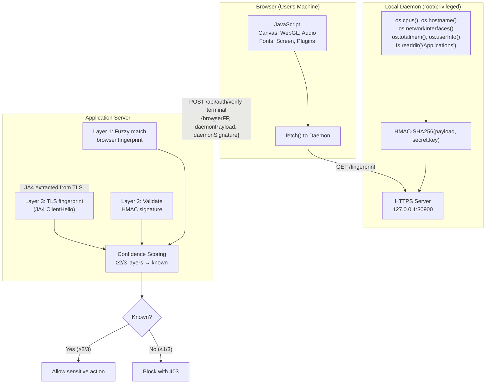
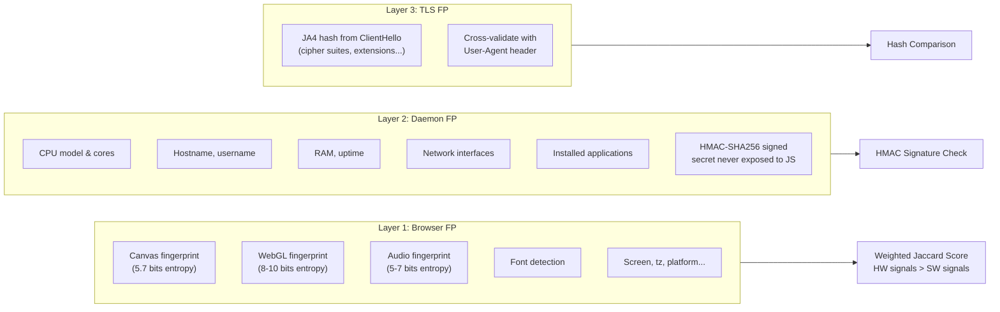
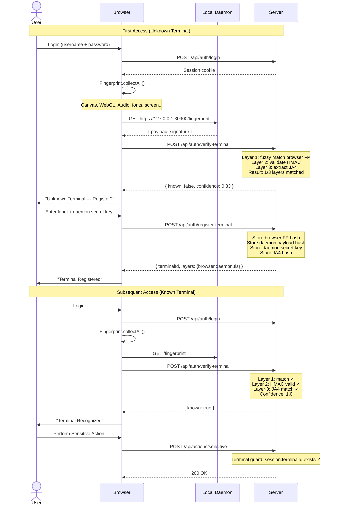
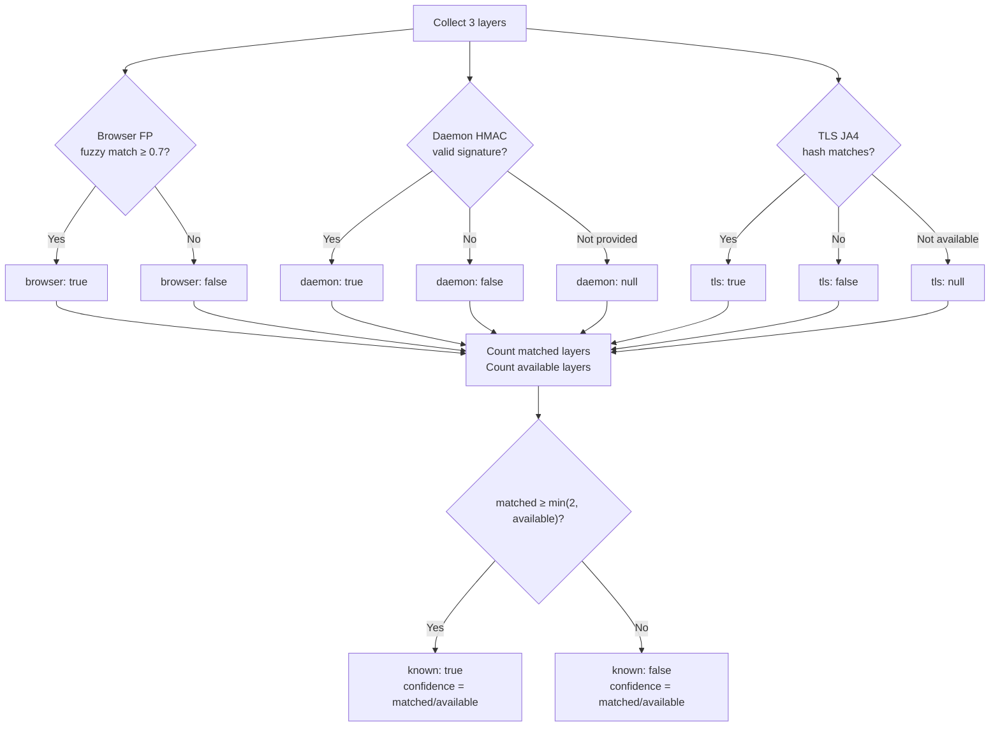

# POCDNA — Terminal Authentication POC

Demonstrates an extra security layer for web applications where each user terminal is uniquely identified by a **three-layer fingerprint** (browser signals + local OS daemon + TLS fingerprint). Only pre-registered terminals can execute sensitive actions.

Inspired by **Warsaw/G-Buster** (GAS Tecnologia/Diebold Nixdorf) — the mandatory security module used by ~25 Brazilian banks (Banco do Brasil, Itaú, Caixa, etc.) for internet banking.

## The Problem

Browser-only fingerprinting (Canvas, WebGL, Audio) is **spoofable** — an attacker with a headless browser (Puppeteer, Playwright) can forge every JavaScript-collected signal.

Warsaw solves this by running a **native daemon** outside the browser that collects real OS-level data the browser cannot access. POCDNA demonstrates this architecture in pure Node.js.

## Architecture



### Layer Breakdown



## Authentication Flow



## The Warsaw Comparison

```mermaid
flowchart LR
    subgraph Warsaw["Warsaw/G-Buster (Production)"]
        direction TB
        W1["Native daemon (C binary)\nRuns as root via systemd"]
        W2["Kernel driver (gbpkm.sys)\nAnti-keylogger, anti-termination"]
        W3["CA cert injection\ncertutil into browser trust stores"]
        W4["WebSocket wss://127.0.0.1:30900\nSelf-signed TLS"]
        W5["Anti-VM/sandbox detection\nReturns r:0 in containers"]
    end

    subgraph POCDNA["POCDNA (Demonstration)"]
        direction TB
        P1["Node.js daemon\nnode daemon.js"]
        P2["No kernel driver\nDocumented as production gap"]
        P3["Manual cert trust\nUser accepts browser warning"]
        P4["HTTPS GET 127.0.0.1:30900\nSelf-signed TLS"]
        P5["No anti-VM detection\nDocumented as production gap"]
    end

    Warsaw -. "Mirrors architecture" .-> POCDNA
```



## Quick Start

Prerequisites: **Docker**, **Node.js 20+**, **openssl** (for daemon TLS cert)

```bash
# 1. Start the server
docker compose up -d

# 2. Start the local daemon
node daemon/daemon.js

# 3. Open http://localhost:3000/login.html
#    Login: demo / demo123
```

## Demo Flow

| Step | Action | Expected |
|---|---|---|
| 1 | Open `http://localhost:3000/login.html` | Login form |
| 2 | Login with `demo` / `demo123` | Redirect to dashboard |
| 3 | Dashboard collects fingerprint + queries daemon | Terminal status badge appears |
| 4 | If unknown: enter label + paste daemon secret key | "Register This Terminal" |
| 5 | Terminal registered → automatically verified | Green badge "Secure" or "Basic" |
| 6 | Click "Perform Sensitive Action" | Success toast |
| 7 | Remove terminal from device list | Terminal gone |
| 8 | Click "Perform Sensitive Action" again | 403 blocked |
| 9 | Open `/admin.html` with key `pocdna-admin-secret` | View/revoke all terminals |

## Confidence Scoring



### Weighted Browser Signals

| Signal | Weight | Type | Stability |
|---|---|---|---|
| Canvas | 25% | Hardware | High (GPU/driver dependent) |
| WebGL | 20% | Hardware | High (GPU vendor/renderer) |
| Audio | 15% | Hardware | High (CPU/DSP dependent) |
| Platform | 10% | Software | Medium |
| Screen | 10% | Software | Medium |
| Fonts | 8% | Software | Medium |
| Timezone | 5% | Config | High |
| HardwareConcurrency | 4% | Hardware | High |
| TouchSupport | 2% | Hardware | High |
| Plugins | 1% | Software | Low (frequently changes) |

## API Reference

| Method | Path | Auth | Description |
|---|---|---|---|
| POST | `/api/auth/register` | — | Create user account |
| POST | `/api/auth/login` | — | Login, creates session |
| POST | `/api/auth/logout` | Session | Destroy session |
| GET | `/api/auth/me` | Session | Current user info |
| POST | `/api/auth/register-terminal` | Session | Register new terminal |
| POST | `/api/auth/verify-terminal` | Session | Verify current terminal |
| GET | `/api/auth/user/terminals` | Session | List user's terminals |
| DELETE | `/api/auth/user/terminals/:id` | Session | Remove terminal |
| POST | `/api/actions/sensitive` | Session + Terminal | Simulated sensitive action |
| GET | `/api/admin/terminals` | `x-admin-key` | List all terminals |
| POST | `/api/admin/terminals/:id/revoke` | `x-admin-key` | Revoke terminal |

### Daemon Endpoints

| Method | Path | Description |
|---|---|---|
| GET | `https://127.0.0.1:30900/health` | Health check |
| GET | `https://127.0.0.1:30900/fingerprint` | Returns `{ payload, signature }` |

## Project Structure

```
pocdna/
├── docker-compose.yml
├── README.md
├── docs/
│   └── architecture.md          (detailed architecture docs)
├── specs/
│   ├── terminal-auth-poc.md     (full spec)
│   └── steps/                   (atomic step definitions)
├── daemon/
│   ├── package.json
│   └── daemon.js                (local OS-level daemon, port 30900)
└── server/
    ├── Dockerfile
    ├── package.json
    ├── src/
    │   ├── index.js             (Express application entry point)
    │   ├── db.js                (SQLite database schema & connection)
    │   ├── seed.js              (demo user seeder)
    │   ├── middleware/
    │   │   ├── auth.js          (session authentication guard)
    │   │   ├── ja4.js           (TLS ClientHello fingerprint extraction)
    │   │   └── requireTerminal.js (terminal authorization guard)
    │   ├── routes/
    │   │   ├── auth.js          (user registration & login)
    │   │   ├── terminals.js     (terminal registration & verification)
    │   │   └── admin.js         (admin panel API)
    │   └── services/
    │       └── fingerprint.js   (hashing, fuzzy matching, HMAC, confidence)
    └── public/
        ├── login.html           (login page)
        ├── index.html           (user dashboard)
        ├── admin.html           (admin panel)
        └── js/
            └── fingerprint.js   (browser fingerprinting engine)
```

## Limitations (POC vs Production)

| Aspect | POC | Production (Warsaw/WebAuthn) |
|---|---|---|
| Browser FP | Custom JS (~10 signals) | Fingerprint Pro (100+ signals) |
| Daemon | Node.js script | Native binary (C) |
| Kernel protection | None | Kernel driver (anti-keylogger) |
| Secret storage | Plain file (`/tmp`) | TPM / Secure Enclave |
| TLS trust | Manual browser warning | CA cert injected via certutil |
| Anti-VM detection | None | Detects bwrap/FHS containers |
| Device binding | HMAC symmetric key | WebAuthn asymmetric (ECDSA) |

## License

MIT
