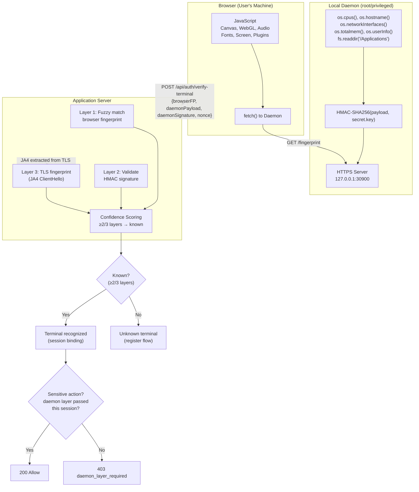
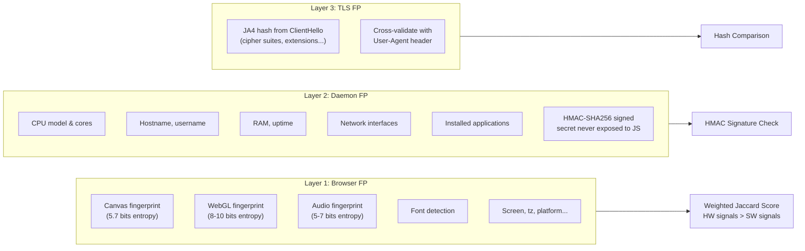
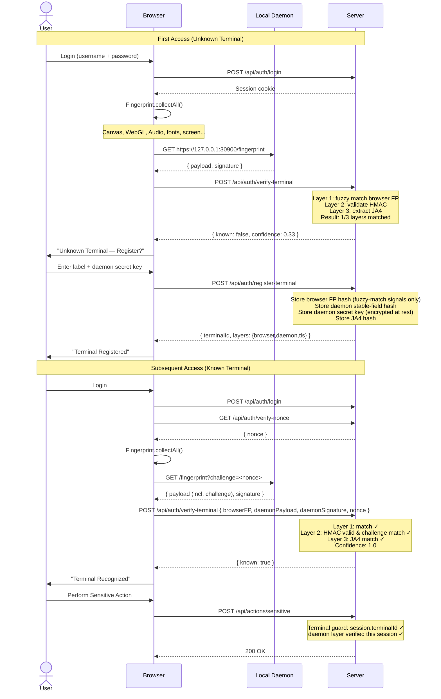
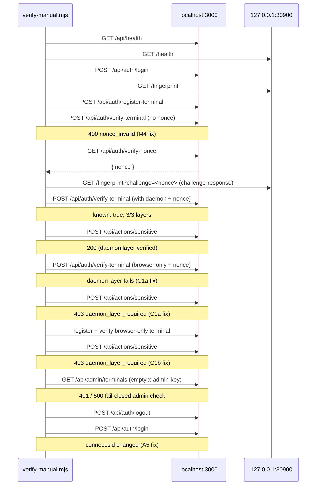
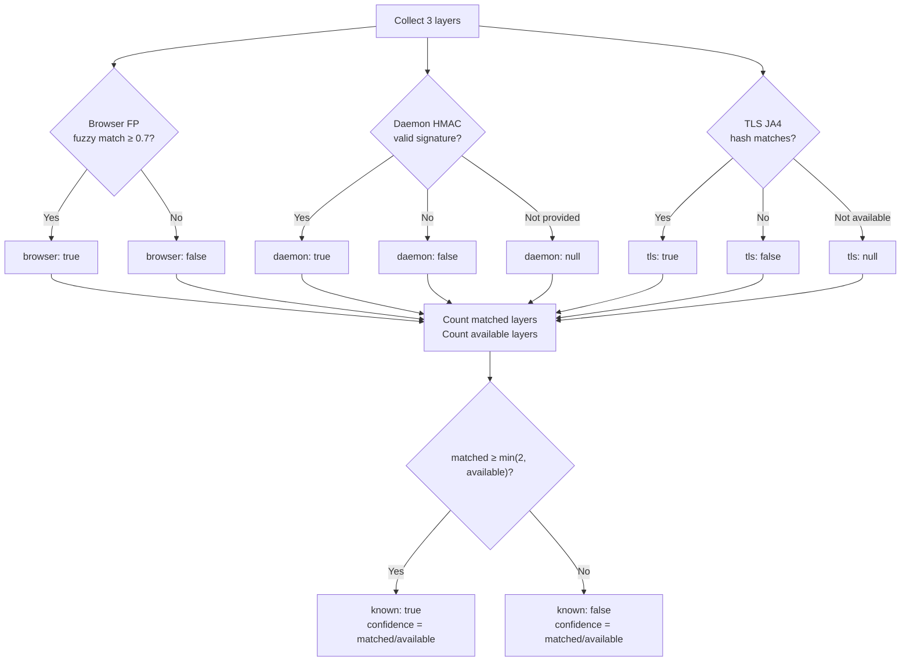

# POCDNA — Terminal Authentication POC

Demonstrates an extra security layer for web applications where each user terminal is uniquely identified by a **three-layer fingerprint** (browser signals + local OS daemon + TLS fingerprint). Only pre-registered terminals can execute sensitive actions.

Inspired by **Warsaw/G-Buster** (GAS Tecnologia/Diebold Nixdorf) — the mandatory security module used by ~25 Brazilian banks (Banco do Brasil, Itaú, Caixa, etc.) for internet banking.

## The Problem

Browser-only fingerprinting (Canvas, WebGL, Audio) is **spoofable** — an attacker with a headless browser (Puppeteer, Playwright) can forge every JavaScript-collected signal.

Warsaw solves this by running a **native daemon** outside the browser that collects real OS-level data the browser cannot access. POCDNA demonstrates this architecture in pure Node.js.

## Architecture



> Recognition (`known: true`) and sensitive-action authorization are **separate
> decisions**: 2 of 3 layers are enough to recognize a terminal, but sensitive
> actions additionally require the **daemon layer** to have passed in the current
> session — it is the only layer a headless browser cannot forge. See
> [Security Model](#security-model).

### Layer Breakdown



## Authentication Flow



## The Warsaw Comparison

```mermaid
flowchart LR
    subgraph Warsaw["Warsaw/G-Buster (Production)"]
        direction TB
        W1["Native daemon (C binary)\nRuns as root via systemd"]
        W2["Kernel driver (gbpkm.sys)\nAnti-keylogger, anti-termination"]
        W3["CA cert injection\ncertutil into browser trust stores"]
        W4["WebSocket wss://127.0.0.1:30900\nSelf-signed TLS"]
        W5["Anti-VM/sandbox detection\nReturns r:0 in containers"]
    end

    subgraph POCDNA["POCDNA (Demonstration)"]
        direction TB
        P1["Node.js daemon\nnode daemon.js"]
        P2["No kernel driver\nDocumented as production gap"]
        P3["mkcert → openssl → HTTP\nmkcert injects CA into OS trust store\n(zero browser warnings)"]
        P4["HTTPS GET 127.0.0.1:30900\nLocally-trusted TLS"]
        P5["No anti-VM detection\nDocumented as production gap"]
    end

    Warsaw -. "Mirrors architecture" .-> POCDNA
```



## Quick Start

Prerequisites: **Docker**, **Node.js 20+**

```bash
# (Optional) Install mkcert for locally-trusted TLS — zero browser warnings
#   macOS:  brew install mkcert && mkcert -install
#   Linux:  apt install mkcert && mkcert -install
#   Windows: choco install mkcert && mkcert -install

# 1. Configure secrets (ADMIN_KEY enables the admin panel)
cp .env.example .env  # then fill in the values

# 2. Start the server
docker compose up -d

# 3. Start the local daemon (generates TLS cert via mkcert → openssl → HTTP)
node daemon/daemon.js

# 4. Open https://localhost:3000/login.html
#    (self-signed cert — accept the browser warning)
#    Login: demo / demo123
```

> **Server TLS:** the server terminates TLS directly (self-signed cert generated
> via openssl on first start) so the JA4 layer can read the TLS ClientHello.
> To avoid the browser warning, point `TLS_CERT_PATH`/`TLS_KEY_PATH` to a
> mkcert-generated pair. Without openssl the server falls back to plain HTTP
> and the JA4 layer is disabled.
>
> **Daemon TLS:** the daemon auto-detects the best available method:
> - **mkcert** (recommended) — locally-trusted cert, no browser warnings
> - **openssl** — self-signed cert, browser shows a warning (click Advanced → Proceed)
> - **HTTP** — no TLS, only if neither mkcert nor openssl is installed

### Running without Docker

```bash
cd server
npm ci
npm start          # https://localhost:3000 (data/ is created automatically)
```

### Running tests

```bash
cd server
npm test           # unit tests (node:test) — fingerprint service
```

## Configuration

All variables are optional — the POC boots with safe defaults. Copy
`.env.example` to `.env` for Docker Compose, or export them in the shell for
local runs.

### Server

| Variable | Default | Purpose |
|---|---|---|
| `PORT` | `3000` | HTTP(S) listen port |
| `ADMIN_KEY` | *(empty)* | `x-admin-key` for the admin panel. Empty = admin API disabled (fail-closed) |
| `SESSION_SECRET` | random per boot | express-session secret. Unset = sessions reset on restart |
| `SECRET_ENC_KEY` | auto-generated file | AES-256 key (base64, 32 bytes) for daemon secrets at rest. Unset = key file at `server/data/secret-enc.key` |
| `TLS_CERT_PATH` / `TLS_KEY_PATH` | auto-generated | Existing TLS pair (e.g. mkcert) instead of the self-signed cert |

### Daemon

| Variable | Default | Purpose |
|---|---|---|
| `POCDNA_DIR` | `~/.pocdna` | State directory (secret key + TLS cert), created with `0700` |
| `SECRET_KEY_PATH` | `$POCDNA_DIR/secret.key` | HMAC secret key file (`0600`) |
| `CERT_PATH` / `KEY_PATH` | `$POCDNA_DIR/cert.pem` / `key.pem` | Daemon TLS pair |
| `ALLOWED_ORIGINS` | `https?://localhost:3000`, `https?://127.0.0.1:3000` | CORS allowlist for browser → daemon requests |

### verify-manual.mjs

| Variable | Default | Purpose |
|---|---|---|
| `BASE_URL` | `https://localhost:3000` | Server under test |
| `SECRET_KEY_PATH` | `~/.pocdna/secret.key` | Daemon secret used to register the test terminal |

## Security Model

What each mechanism protects against, and where it is enforced:

| Mechanism | Protects against | Enforcement |
|---|---|---|
| ≥2/3 layer quorum for recognition | Single-signal spoofing | `computeConfidence` (`services/fingerprint.js`) |
| Daemon layer required **per session** for sensitive actions | Headless-browser spoofing, browser+TLS-only recognition | `requireKnownTerminal` (`middleware/requireTerminal.js`) |
| Daemon payload timestamp (60s window) | Replay of captured daemon payloads | `validateDaemonHmac` |
| Single-use verification nonce (5 min TTL) | Replay of captured verify requests | `GET /api/auth/verify-nonce` + `verify-terminal` |
| Session regeneration on login | Session fixation | `establishUserSession` (`routes/auth.js`) |
| Rate limiting (login 20/15min/IP, terminal registration 10/h/user) | Brute force, registration abuse | `middleware/rateLimit.js` |
| Daemon secrets encrypted at rest (AES-256-GCM) | SQLite file/backup leaks | `services/secret-vault.js`, [ADR 001](adr/001-daemon-secret-storage.md) |
| Data minimization (only the 10 fuzzy-match signals persisted; raw daemon payload discarded) | PII exposure via DB | `pickBrowserSignals` / `pickStableDaemonFields` |
| Constant-time comparisons (`timingSafeEqual`) | Timing attacks on HMAC/admin key/nonce | fingerprint service, admin routes, nonce check |
| Anti-enumeration (dummy bcrypt hash) | Username probing via login timing | `routes/auth.js` |
| Central error boundary, `{ code, message }` shape | Stack trace / internal detail leaks | `middleware/errorHandler.js` |

**Explicitly out of scope** (see [Limitations](#limitations-poc-vs-production)):
session hijacking on an already-verified terminal, local attackers reading the
daemon key from disk, kernel-level tampering with the daemon.

## Manual Verification

Automated checks for security fixes (daemon layer required for sensitive actions, verification nonce, session regeneration). Requires server and daemon running (see Quick Start).

```bash
node scripts/verify-manual.mjs
```



| Check | Expected |
|---|---|
| Verify without nonce | `400 nonce_invalid` |
| Verify with daemon & challenge | `known: true`, sensitive action allowed |
| Verify without `daemonPayload` | daemon layer fails, sensitive action `403` |
| Browser-only ("weak") terminal | recognized, sensitive action `403` |
| Admin with invalid/empty key | `401` or `500` fail-closed |
| Login after logout | New `connect.sid` cookie |

## Demo Flow

| Step | Action | Expected |
|---|---|---|
| 1 | Open `https://localhost:3000/login.html` | Login form |
| 2 | Login with `demo` / `demo123` | Redirect to dashboard |
| 3 | Dashboard collects fingerprint + queries daemon | Terminal status badge appears |
| 4 | If unknown: enter label + paste daemon secret key | "Register This Terminal" |
| 5 | Terminal registered → automatically verified | Green badge "Secure" or "Basic" |
| 6 | Click "Perform Sensitive Action" | Success toast (requires daemon layer) |
| 7 | Remove terminal from device list | Terminal gone |
| 8 | Click "Perform Sensitive Action" again | 403 blocked |
| 9 | Open `/admin.html` with the `ADMIN_KEY` from your `.env` | View/revoke all terminals |

## Confidence Scoring



### Weighted Browser Signals

| Signal | Weight | Type | Stability |
|---|---|---|---|
| Canvas | 25% | Hardware | High (GPU/driver dependent) |
| WebGL | 20% | Hardware | High (GPU vendor/renderer) |
| Audio | 15% | Hardware | High (CPU/DSP dependent) |
| Platform | 10% | Software | Medium |
| Screen | 10% | Software | Medium |
| Fonts | 8% | Software | Medium |
| Timezone | 5% | Config | High |
| HardwareConcurrency | 4% | Hardware | High |
| TouchSupport | 2% | Hardware | High |
| Plugins | 1% | Software | Low (frequently changes) |

## API Reference

| Method | Path | Auth | Description |
|---|---|---|---|
| POST | `/api/auth/register` | — | Create user account |
| POST | `/api/auth/login` | — | Login, creates session |
| POST | `/api/auth/logout` | Session | Destroy session |
| GET | `/api/auth/me` | Session | Current user info |
| POST | `/api/auth/register-terminal` | Session | Register new terminal (rate limit: 10/user/hour) |
| GET | `/api/auth/verify-nonce` | Session | Single-use nonce for verification |
| POST | `/api/auth/verify-terminal` | Session | Verify current terminal (requires nonce) |
| GET | `/api/user/terminals` | Session | List user's terminals |
| DELETE | `/api/user/terminals/:id` | Session | Remove terminal |
| POST | `/api/actions/sensitive` | Session + Terminal (daemon layer) | Simulated sensitive action |
| GET | `/api/admin/terminals` | `x-admin-key` | List all terminals |
| POST | `/api/admin/terminals/:id/revoke` | `x-admin-key` | Revoke terminal |

### Error responses

Errors always return `{ "code": string, "message": string }` — `code` is a
stable machine-readable identifier, `message` is safe for display.

| Code | Status | Meaning |
|---|---|---|
| `validation_error` | 400 | Missing/invalid body fields (user register/login) |
| `invalid_label` / `browser_fp_required` | 400 | Invalid terminal registration payload |
| `invalid_daemon_signature` | 400 | Daemon HMAC failed (wrong secret or stale timestamp) |
| `nonce_invalid` | 400 | Missing, expired or reused verification nonce |
| `auth_required` | 401 | No valid session |
| `invalid_credentials` | 401 | Login failed (generic — no user enumeration) |
| `invalid_admin_key` | 401 | Wrong or missing `x-admin-key` |
| `terminal_not_authorized` | 403 | No verified terminal in this session |
| `terminal_revoked` | 403 | Terminal was revoked; re-register |
| `daemon_layer_required` | 403 | Sensitive action without the daemon layer verified this session |
| `terminal_limit_reached` | 403 | More than 5 active terminals |
| `terminal_not_found` | 404 | Unknown or not-owned terminal id |
| `username_taken` / `terminal_already_registered` | 409 | Duplicate resource |
| `terminal_already_revoked` | 409 | Revoke called twice |
| `rate_limited` | 429 | Too many requests (login or terminal registration) |
| `session_error` / `logout_failed` | 500 | Session store failure |
| `internal_error` | 500 | Unexpected failure (details only in server logs) |

### Daemon Endpoints

| Method | Path | Description |
|---|---|---|
| GET | `https://127.0.0.1:30900/health` | Health check |
| GET | `https://127.0.0.1:30900/fingerprint` | Returns `{ payload, signature }` |

## Project Structure

```
pocdna/
├── docker-compose.yml
├── .env.example                 (secrets template — copy to .env)
├── README.md
├── adr/
│   └── 001-daemon-secret-storage.md (encryption-at-rest decision)
├── scripts/
│   └── verify-manual.mjs        (automated security verification)
├── docs/
│   ├── architecture.md          (detailed architecture docs)
│   └── melhorias-futuras.md     (roadmap POC → produção)
├── specs/
│   ├── terminal-auth-poc.md     (full spec)
│   └── steps/                   (atomic step definitions)
├── daemon/
│   ├── package.json
│   └── daemon.js                (local OS-level daemon, port 30900)
└── server/
    ├── Dockerfile
    ├── package.json
    ├── src/
    │   ├── index.js             (Express application entry point, HTTPS + JA4 tracking)
    │   ├── tls.js               (server TLS cert load/generate)
    │   ├── log.js               (structured JSON logging)
    │   ├── db.js                (SQLite database schema & connection)
    │   ├── seed.js              (demo user seeder)
    │   ├── middleware/
    │   │   ├── auth.js          (session authentication guard)
    │   │   ├── ja4.js           (JA4 hash from tracked TLS ClientHello)
    │   │   ├── rateLimit.js     (in-memory fixed-window rate limiter)
    │   │   ├── errorHandler.js  (central error boundary)
    │   │   └── requireTerminal.js (terminal authorization guard)
    │   ├── routes/
    │   │   ├── auth.js          (user registration & login)
    │   │   ├── terminals.js     (terminal registration & verification)
    │   │   └── admin.js         (admin panel API)
    │   └── services/
    │       ├── fingerprint.js   (hashing, fuzzy matching, HMAC, confidence)
    │       └── secret-vault.js  (AES-256-GCM encryption for daemon secrets)
    └── public/
        ├── login.html           (login page)
        ├── index.html           (user dashboard)
        ├── admin.html           (admin panel)
        └── js/
            └── fingerprint.js   (browser fingerprinting engine)
```

## Limitations (POC vs Production)

| Aspect | POC | Production (Warsaw/WebAuthn) |
|---|---|---|
| Browser FP | Custom JS (~10 signals) | Fingerprint Pro (100+ signals) |
| Daemon | Node.js script | Native binary (C) |
| Kernel protection | None | Kernel driver (anti-keylogger) |
| Secret storage | Daemon: plain file (`~/.pocdna`, 0600). Server: AES-256-GCM at rest ([ADR 001](adr/001-daemon-secret-storage.md)) | TPM / Secure Enclave |
| TLS trust | mkcert local CA (zero warnings) or self-signed (manual accept) | CA cert injected via certutil |
| Anti-VM detection | None | Detects bwrap/FHS containers |
| Device binding | HMAC symmetric key (user pastes daemon secret at registration; server stores it encrypted to verify future HMACs) | WebAuthn asymmetric (ECDSA) |

Roadmap pós-POC (priorizado P0–P3): [docs/melhorias-futuras.md](docs/melhorias-futuras.md).

## Troubleshooting

| Symptom | Cause | Fix |
|---|---|---|
| Browser warns about the certificate on `https://localhost:3000` | Self-signed server cert | Accept the warning (POC), or point `TLS_CERT_PATH`/`TLS_KEY_PATH` to a mkcert pair |
| Daemon dot stays red on the dashboard | Daemon not running, or its self-signed cert was never accepted | Run `node daemon/daemon.js`; open `https://127.0.0.1:30900/health` once and accept the warning (or install mkcert) |
| `[server] listening on http://...` + "JA4 layer disabled" | `openssl` not available to generate the server cert | Install openssl or provide `TLS_CERT_PATH`/`TLS_KEY_PATH` |
| Sensitive action returns `403 daemon_layer_required` on a registered terminal | Last verification ran without the daemon (offline/stopped) | Start the daemon and reload the dashboard (re-verify) |
| `401` on `/admin.html` with any key | `ADMIN_KEY` not set (fail-closed) | Set `ADMIN_KEY` in `.env` and restart |
| `429 rate_limited` while testing | Login (20/15min/IP) or registration (10/h/user) limit hit | Wait for the window to reset (in-memory — restarting the server also clears it) |
| Terminal stops being recognized after reboot (pre-fix databases) | Daemon key used to live in `/tmp`, wiped on reboot | Keys now live in `~/.pocdna`; re-register the terminal once |

## License

MIT
