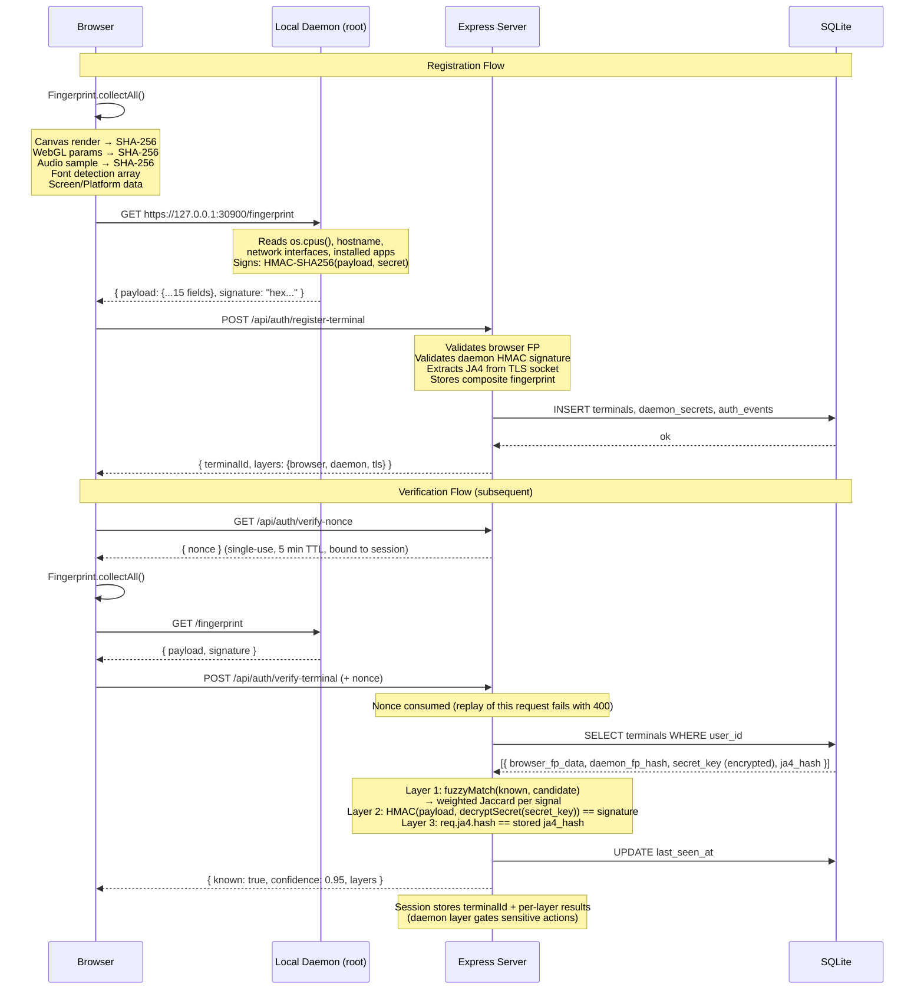
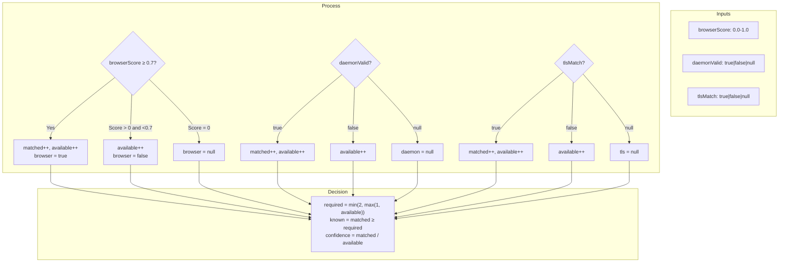
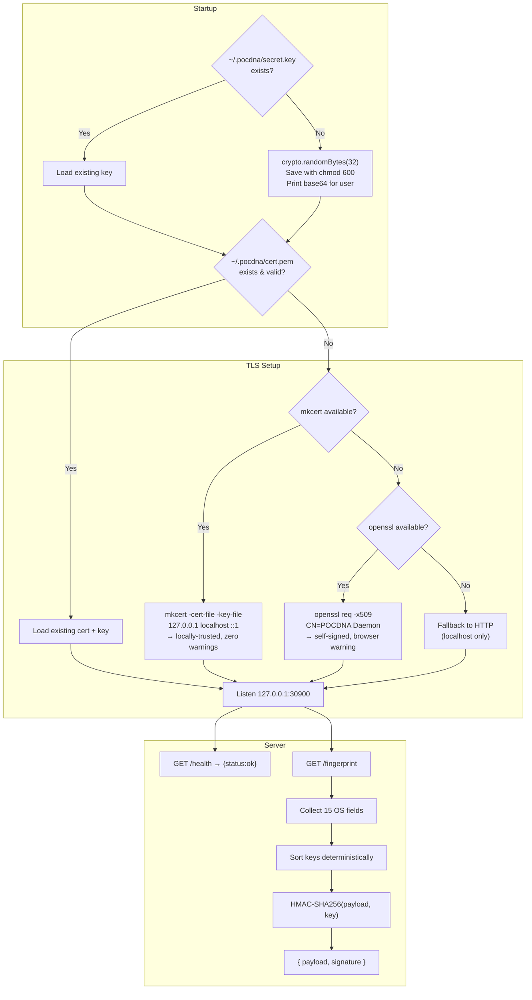
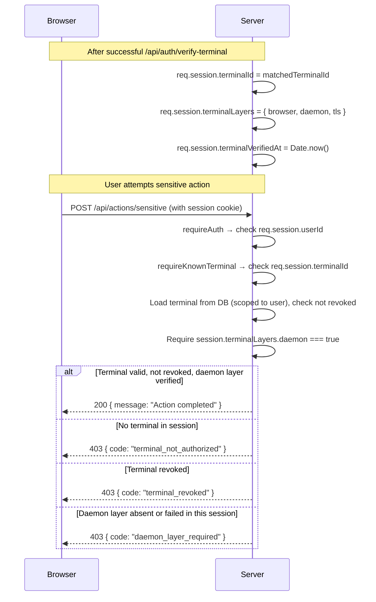

# POCDNA Architecture

## Overview

POCDNA implements terminal-based authentication through a three-layer fingerprinting strategy. Each layer provides signals from a different trust domain — the browser (untrusted), a local daemon (trusted, external to the browser), and the TLS transport (server-observed, client-unaware).

```
TRUST DOMAIN MODEL
═══════════════════════════════════════════════════════════════

  UNTRUSTED (Browser JS)          TRUSTED (OS Daemon)        OBSERVED (Server TLS)
  ┌──────────────────┐            ┌──────────────────┐       ┌──────────────────┐
  │ Canvas   5.7 bits │            │ os.cpus()         │       │ JA4 Hash         │
  │ WebGL    8-10 bits│   HMAC     │ os.hostname()     │       │ Cipher Suites    │
  │ Audio    5-7 bits │ ────────→  │ os.totalmem()     │       │ Extensions       │
  │ Fonts            │  signed    │ os.userInfo()     │       │ Version          │
  │ Screen           │            │ os.networkIfs()   │       │                  │
  │ ...              │            │ fs.readdir()      │       │                  │
  └──────────────────┘            └──────────────────┘       └──────────────────┘
         │                               │                          │
         │  Layer 1: browser             │  Layer 2: daemon         │  Layer 3: tls
         │  fuzzy Jaccard match          │  HMAC validation         │  hash comparison
         │                               │                          │
         └───────────────────────────────┼──────────────────────────┘
                                         │
                                   ┌─────▼──────┐
                                   │  CONFIDENCE │
                                   │   SCORING   │
                                   │  ≥2/3 layers│
                                   └─────┬──────┘
                                         │
                                   ┌─────▼──────┐
                                   │  ALLOW/DENY │
                                   └────────────┘
```

The decision is two-staged: ≥2 of 3 layers **recognize** the terminal (session
binding), but **sensitive actions** additionally require the daemon layer to
have passed in the current session — it is the only layer a headless browser
cannot forge (see [Session & Terminal Binding](#session--terminal-binding)).

## Component Interaction



## Database Schema

```mermaid
erDiagram
    users {
        TEXT id PK "UUID"
        TEXT username UK "Unique username"
        TEXT password_hash "bcrypt 12 rounds"
        TEXT created_at "ISO 8601"
    }

    terminals {
        TEXT id PK "UUID"
        TEXT user_id FK "References users.id"
        TEXT label "User-given name"
        TEXT browser_fp_hash "SHA-256 of fuzzy-match signals"
        TEXT browser_fp_data "JSON: fuzzy-match signals only (no userAgent)"
        TEXT daemon_fp_hash "SHA-256 of stable daemon fields"
        TEXT daemon_fp_data "Unused - raw payload never persisted"
        TEXT ja4_hash "TLS ClientHello hash"
        TEXT registered_at "ISO 8601"
        TEXT last_seen_at "ISO 8601"
        TEXT revoked_at "NULL until revoked"
    }

    daemon_secrets {
        TEXT terminal_id PK_FK "1:1 with terminals"
        TEXT secret_key "AES-256-GCM encrypted at rest (ADR 001)"
        TEXT created_at "ISO 8601"
    }

    auth_events {
        TEXT id PK "UUID"
        TEXT user_id FK "References users.id"
        TEXT terminal_id FK "Nullable"
        TEXT event_type "REGISTER, VERIFY_OK, VERIFY_FAIL, REVOKE"
        REAL confidence "0.0 to 1.0"
        TEXT layers_matched "JSON: {browser, daemon, tls}"
        TEXT ip_address "Request IP"
        TEXT user_agent "Browser UA"
        TEXT ja4_observed "JA4 at event time"
        TEXT created_at "ISO 8601"
    }

    users ||--o{ terminals : "owns"
    terminals ||--o| daemon_secrets : "has"
    users ||--o{ auth_events : "generates"
    terminals ||--o{ auth_events : "referenced in"
```

## Confidence Scoring Algorithm



### Browser FP Fuzzy Matching

The weighted Jaccard algorithm compares stored vs candidate fingerprint components:

```
FOR each signal WITH weight:
  IF signal is list (fonts, plugins):
    similarity = |intersection| / |union|
    score += similarity × weight
  ELSE:
    score += (stored == candidate) ? weight : 0

totalScore = score / totalWeight
```

Hardware-dependent signals (Canvas: 25%, WebGL: 20%, Audio: 15%) receive higher weights because they're stable across browser upgrades and resistant to spoofing. Software signals (Plugins: 1%) receive low weights because they change frequently.

## Daemon Architecture



### Why the daemon runs outside Docker

The daemon must run on the host machine (not containerized) because:
1. It collects **real** OS data (`os.cpus()`, `os.networkInterfaces()`, `os.hostname()`)
2. Container isolation would expose the container's virtualized OS, not the host's
3. This mirrors Warsaw — the daemon is an **external, privileged component**, not part of the browser or server

## Session & Terminal Binding



The terminal verification result (including per-layer outcomes) is cached in the session — subsequent requests from the same session don't need to re-collect the fingerprint. Sensitive actions additionally require that the **daemon layer** passed in the current session: recognition via browser+TLS alone (2/3 quorum) never unlocks them, because the daemon HMAC is the only layer a headless browser cannot forge. This is a POC optimization; production would re-verify at configurable intervals.

## Security Considerations

### What the daemon solves

| Threat | Browser-only FP | With Daemon |
|---|---|---|
| Headless browser spoofing (Puppeteer) | ❌ Trivial bypass | ✅ Daemon HMAC can't be forged from browser context |
| Canvas fingerprint replay | ❌ Capture & replay | ✅ Daemon timestamp rejects old payloads |
| User-Agent spoofing | ❌ Trivial string change | ✅ JA4 cross-validates UA against actual TLS stack |

### What remains (production gaps)

| Gap | POC State | Production Path |
|---|---|---|
| Secret key on disk | Daemon: readable by user processes (`~/.pocdna`, 0600). Server: AES-256-GCM at rest ([ADR 001](../adr/001-daemon-secret-storage.md)) | TPM/HSM-bound key, Secure Enclave |
| Daemon is a script | Can be killed, replaced | Native binary with kernel driver (Warsaw's `gbpkm.sys`) |
| No anti-VM detection | VM fingerprint identical to host | Detect hypervisor artifacts, SMBIOS |
| CA cert not trusted | User sees browser warning (openssl) or zero warnings (mkcert) | Inject CA into trust stores (Warsaw's `certutil -A`) |
| HMAC symmetric key | Server knows the secret | WebAuthn asymmetric (private key never leaves device) |

A per-mechanism map of security controls (rate limits, nonce, encryption at
rest, data minimization, timing-safe comparisons) lives in the README's
[Security Model](../README.md#security-model) section.

## Observability

Two complementary trails:

**Structured logs (stdout, JSON)** — emitted via `log.js` (`logEvent`), one
object per line with `event`, `ts` and event-specific fields. Never contain
secrets, raw fingerprints or unmasked PII.

| Event | When |
|---|---|
| `terminal.registered` | New terminal stored (with per-layer availability) |
| `terminal.verified` | Verification matched (confidence + layers) |
| `terminal.mismatch` | Verification failed (best confidence + layers) |
| `terminal.revoked` | Terminal revoked (`revoked_by: user \| admin`) |
| `ja4.extracted` / `ja4.extraction_failed` | TLS fingerprint captured (or not) per connection |
| `session.destroy_failed` | Session store error on logout |

**Audit table (`auth_events`)** — persistent record per security-relevant
action (`REGISTER`, `VERIFY_OK`, `VERIFY_FAIL`, `REVOKE`) with confidence,
per-layer results, IP, User-Agent and observed JA4. Feeds the admin panel and
would feed fraud analysis in a real deployment.

## File Map

```
pocdna/
├── docker-compose.yml          → Single service: server on port 3000 (secrets via .env)
├── .env.example                → ADMIN_KEY, SESSION_SECRET, SECRET_ENC_KEY template
├── adr/
│   └── 001-daemon-secret-storage.md → Encryption-at-rest decision
├── scripts/
│   └── verify-manual.mjs       → End-to-end security verification (17 checks)
├── docs/
│   └── architecture.md         → This document
├── server/
│   ├── Dockerfile              → node:20-alpine (+openssl), npm ci, runs src/index.js
│   ├── src/
│   │   ├── index.js            → Express app: HTTPS + trackClientHellos, session, all routers
│   │   ├── tls.js              → Server TLS cert: load (TLS_CERT_PATH/TLS_KEY_PATH) or self-sign via openssl
│   │   ├── log.js              → logEvent: structured JSON logging to stdout
│   │   ├── db.js               → better-sqlite3 with WAL, 4 tables, lazy init
│   │   ├── seed.js             → Creates demo/demo123 if not exists
│   │   ├── middleware/
│   │   │   ├── auth.js         → requireAuth: checks req.session.userId
│   │   │   ├── ja4.js          → extractJa4: copies socket.tlsClientHello.ja4 to req.ja4
│   │   │   ├── rateLimit.js    → in-memory fixed-window limiter (login, register-terminal)
│   │   │   ├── errorHandler.js → central error boundary ({ code, message }, no stack leak)
│   │   │   └── requireTerminal.js → requireKnownTerminal: session terminal + daemon layer
│   │   ├── routes/
│   │   │   ├── auth.js         → /api/auth/register|login|logout|me
│   │   │   ├── terminals.js    → /api/auth/register-terminal|verify-nonce|verify-terminal + /api/user/terminals
│   │   │   └── admin.js        → /api/admin/terminals (list + revoke)
│   │   └── services/
│   │       ├── fingerprint.js  → hashComponents, fuzzyMatchBrowserFP, validateDaemonHmac, computeConfidence
│   │       └── secret-vault.js → AES-256-GCM encrypt/decrypt for daemon secrets
│   └── public/
│       ├── login.html          → Login/register form, dark theme
│       ├── index.html          → Dashboard: status, registration, device list, sensitive action
│       ├── admin.html          → Admin: all terminals table, revoke button
│       └── js/
│           └── fingerprint.js  → Browser FP engine: 10 signals → visitorId + components
└── daemon/
    └── daemon.js               → OS daemon: secret key (~/.pocdna), os.* collection, HMAC signing, HTTPS server
```
