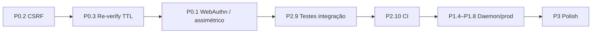

# Melhorias futuras

_Idioma: pt-BR | Domínio: autenticação de terminal | Tipo: roadmap POC → produção | Atualizado em: 2026-08-09_

Documento de backlog pós-avaliação da POC (nota 87/100). Lista o que já está
deliberadamente fora de escopo e o que elevaria o projeto de demonstração para
algo próximo de produção — sem misturar com bugs já corrigidos no ciclo de
review.

Referências: [README — Limitations](../README.md#limitations-poc-vs-production),
[README — Security Model](../README.md#security-model),
[architecture.md](./architecture.md),
[ADR 001](../adr/001-daemon-secret-storage.md).

---

## Prioridade

| Prioridade | Critério |
|---|---|
| P0 | Fecha gap de segurança real se alguém tentar usar a POC “de verdade” |
| P1 | Eleva fidelidade ao modelo Warsaw/WebAuthn ou endurece o contrato |
| P2 | Qualidade de engenharia (testes, CI, observabilidade) |
| P3 | Nice-to-have / polish |

---

## P0 — Segurança operacional

### 1. Binding assimétrico (WebAuthn / chave no dispositivo)

**Estado atual:** o usuário cola a chave HMAC do daemon no registro; o servidor
armazena o segredo (cifrado em repouso) e recomputa HMACs. Quem tem acesso ao
SQLite + chave de cifra, ou ao paste do usuário, pode forjar Layer 2.

**Melhoria:** migrar Layer 2 para desafio-assinatura assimétrica (WebAuthn ou
ECDSA/Ed25519 no daemon). A chave privada nunca sai do dispositivo; o servidor
guarda só a chave pública.

**Critério de aceite:** registro não transmite segredo; verificação usa
challenge single-use + assinatura; remoção do fluxo “colar secret.key”.

### 2. Proteção CSRF nas rotas mutáveis

**Estado atual:** sessão em cookie `connect.sid` sem token CSRF. Em um deploy
real com cookie `SameSite` fraco ou origem compartilhada, ações sensíveis
ficam expostas a CSRF.

**Melhoria:** token CSRF double-submit ou header custom obrigatório em
`POST`/`DELETE` autenticados; cookie com `SameSite=Strict` (ou `Lax` + CSRF).

**Critério de aceite:** request mutável sem token → `403` com código estável;
`verify-manual.mjs` cobre o caso negativo.

### 3. Re-verificação periódica do terminal na sessão

**Estado atual:** após `verify-terminal` com sucesso, `terminalId` +
`terminalLayers` ficam na sessão sem TTL de rechecagem. Hijack de sessão
cookie já verificada não força novo fingerprint.

**Melhoria:** TTL curto (ex.: 5–15 min) para `terminalVerifiedAt`; ações
sensíveis exigem re-verify se expirado; opcionalmente re-verify em toda ação
crítica.

**Critério de aceite:** sessão com verify antigo → `403` (ou force
re-verify) antes de `/api/actions/sensitive`.

---

## P1 — Fidelidade ao modelo de produção

### 4. Daemon nativo + proteção de processo

**Estado atual:** `node daemon/daemon.js`, matável e substituível pelo usuário
local.

**Melhoria:** binário nativo (Go/Rust/C), serviço de sistema (launchd/systemd),
assinatura de código, e — se o alvo for paridade Warsaw — driver/kernel module
anti-término (escopo alto; documentar como gap mesmo se não implementado).

### 5. Segredo do daemon em TPM / Secure Enclave

**Estado atual:** `~/.pocdna/secret.key` com `0600` — legível por processos do
mesmo usuário.

**Melhoria:** material criptográfico no TPM/Secure Enclave; daemon só assina
via API do HSM local.

### 6. Anti-VM / anti-sandbox

**Estado atual:** fingerprint de VM é indistinguível do host.

**Melhoria:** sinais de hypervisor (SMBIOS, CPUID, artefatos de container
bwrap/FHS) e política de rejeição ou score reduzido — alinhado ao comportamento
Warsaw (`r:0` em containers).

### 7. Confiança TLS sem aviso no browser

**Estado atual:** servidor self-signed (aviso) ou mkcert opcional; daemon com
cascata mkcert → openssl → HTTP.

**Melhoria:** instalação guiada de CA local (ou mTLS daemon↔browser) sem
intervenção manual “Advanced → Proceed”.

### 8. Extrair JA4 na borda (proxy / edge)

**Estado atual:** Express termina TLS direto via `trackClientHellos` — incompatível
com nginx/ALB na frente sem perda do ClientHello.

**Melhoria:** JA4 (ou JA3) injetado por header confiável do edge; servidor
valida origem do header; documentar contrato de trust com o proxy.

---

## P2 — Engenharia e verificação

### 9. Testes de integração das rotas e guards

**Estado atual:** unit tests só em `fingerprint.js` (15 casos) +
`scripts/verify-manual.mjs` (e2e manual/automático local).

**Melhoria:** suite Node `node:test` (ou Vitest) cobrindo:
- login / session regenerate
- register + verify + nonce
- `requireKnownTerminal` (`daemon_layer_required`, revoked, missing)
- rate limit 429
- admin fail-closed

**Critério de aceite:** `npm test` no `server/` roda unit + integração sem
Docker obrigatório (SQLite em temp dir).

### 10. CI no GitHub Actions

**Estado atual:** sem pipeline.

**Melhoria:** workflow em push/PR: `npm ci`, `npm test`, opcionalmente
`verify-manual.mjs` contra server+daemon em job composto; lint se adotado.

### 11. Rate limit compartilhado (multi-instância)

**Estado atual:** limiter in-memory — inválido com >1 processo.

**Melhoria:** Redis (ou store de sessão já existente) como backend do bucket;
ou documentar “single-instance only” como restrição de deploy.

### 12. Observabilidade além de stdout

**Estado atual:** `logEvent` JSON + tabela `auth_events`.

**Melhoria:** `request_id`/`trace_id` em todo log; métricas
(verify_ok/fail, daemon_layer_required, rate_limited); painel admin com
timeline de eventos por usuário.

---

## P3 — Polish e produto

### 13. UX do registro do terminal

Fluxo “colar secret.key” é frágil. Com WebAuthn (item 1) some; sem ele:
QR/deeplink `pocdna://register?challenge=…` ou leitura automática via daemon
local autenticado.

### 14. Política de terminais

- Limite configurável (hoje fixo em 5)
- Notificação ao usuário quando novo terminal é registrado
- Soft lockout após N `VERIFY_FAIL`

### 15. Frontend menos “POC HTML”

Dashboard atual cumpre o demo. Evolução: app mínimo (mesmo vanilla) com
estados de loading/erro alinhados aos `code` estáveis, e copy em pt-BR se o
produto for BR-first.

### 16. Hardening de inputs e headers

Helmet/CSP, body size limits explícitos, validação de schema (Zod/Yup) na
borda em vez de checks manuais espalhados.

---

## Ordem sugerida de execução

CSRF e TTL de sessão são baratos e fecham gaps reais sem mudar o modelo de
confiança. WebAuthn/assimétrico é a mudança de maior impacto (e a que invalida
parte do ADR 001). Testes + CI travam regressão antes de mexer no daemon
nativo.

---

## Explicitamente fora deste backlog

Itens que a POC **não** pretende resolver só com mais código de aplicação:

- Atacante local com root no mesmo host do daemon
- Substituição do daemon sem attestation de software
- Spoofing perfeito de GPU/Canvas em hardware real controlado pelo atacante
  (Layer 1 continua spoofable; o modelo depende de Layer 2)

Esses limites devem permanecer documentados em Limitations mesmo após as
melhorias acima.
